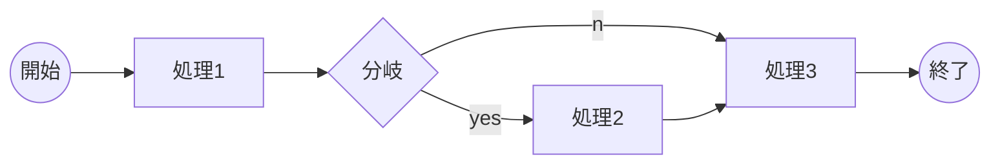

# 見出し1
## 見出し2
### 見出し3
#### 見出し4
##### 見出し5
###### 見出し6


- リスト1
    - ネスト リスト1_1
        - ネスト リスト1_1_1
        - ネスト リスト1_1_2
    - ネスト リスト1_2
- リスト2
- リスト3

1. 番号付きリスト1
    1. 番号付きリスト1_1
    1. 番号付きリスト1_2
1. 番号付きリスト2
1. 番号付きリスト3

- a
- b


> A paragraph of text
>
> Another paragraph
>
> - A list
> - with items

| Tables        | Are           | Cool  |
| ------------- |:-------------:| -----:|
| **col 3 is**  | right-aligned | $1600 |
| col 2 is      | *centered*    |   $12 |
| zebra stripes | ~~are neat~~  |    $1 |


```
some code here
```
*This text will be italic*

**This text will be bold**

a ~~strikethrough~~ element

```
x = 0
x = 2 + 2
what is x
```


* Item
+ Item
- Item

1. Item 1
1. Item 2
1. Item 3

* Bird

* Magic
* Johnson

*   A list item with a blockquote:

    > This is a blockquote
    > inside a list item.